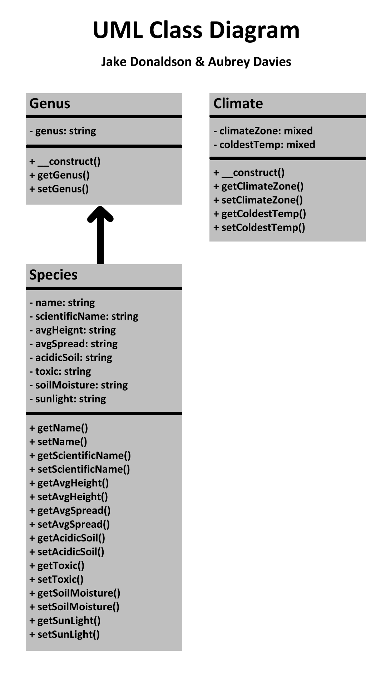
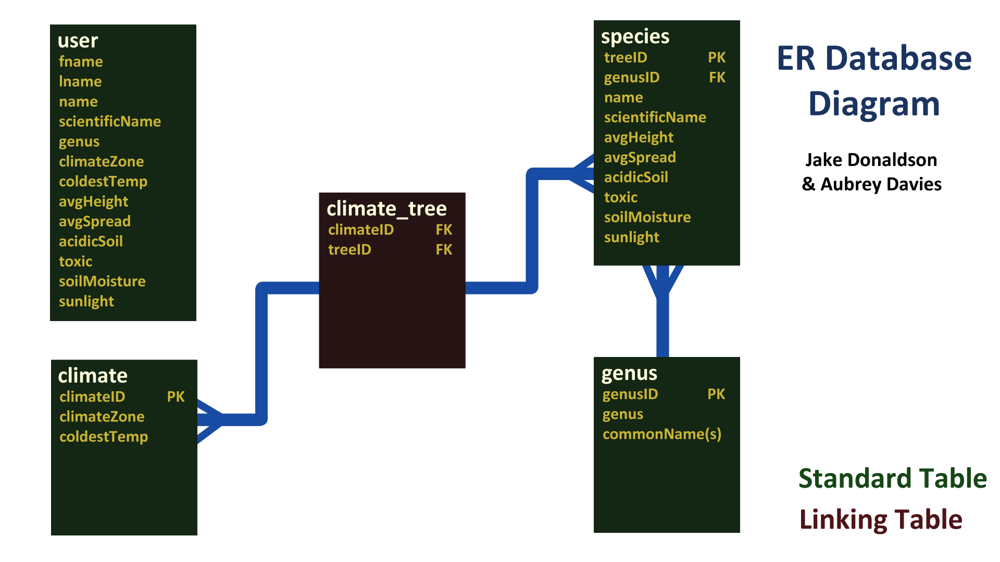

# 328Final---TreeSite

Woodland Wiki

Final project for SDEV328 - Spring2021

Project Desc: A dedrological encyclopedia for species of trees and their climate zones.

Authors:
    -Aubrey Davies
    -Jake Donaldson

***
1. Separates all database/business logic using the MVC pattern.

-   There is no overlap between HTML, CSS, JS, or PHP. The site uses MVC format in order to organize its files.
A controller file handles most PHP and FatFreeFramework interactions. Several PHP classes are provided that
   store objects used throughout the app. A model is also provided which handles database interactions and 
   validation.
 

2. Routes all URLs and leverages a templating language using the Fat-Free framework.

-   The app uses the FatFreeFramework routing technique in order to display view pages.
  

3. Has a clearly defined database layer using PDO and prepared statements. You should have at least two related tables

-   A datalayer file is provided that handles database operations. The app uses several related tables including
species, climate and genus.
  
 
4. Data can be viewed and added.

-    The results page allows users of the app to view data in the database. Users may also choose to submit their own
trees for approval.
  
 
5. Has a history of commits from both team members to a Git repository. Commits are clearly commented.

-   There is a history of regular commits from both developers. Each meetup has involved at least one commit from 
each developer.
  
 
6. Uses OOP, and defines multiple classes, including at least one inheritance relationship.

-   Several classes have been defined, as well having some files being turn into classes. There are two classes 
that share an inheritance relationship; those being genus and species, which extends genus.
  
 
7. Contains full Docblocks for all PHP files and follows PEAR standards.

-   All provided classes have been adequately Docblocked and all other code has been checked for PEAR standards.

8. Has full validation on the client side through JavaScript and server side through PHP.

-   A JavaScript file has been provided that handles client-side validation. Several PHP validation functions have 
been included in model.php, which validate data on the server side, provided that a user has disabled JavaScript 
   on their device.
 
  
9. All code is clean, clear, and well-commented. DRY (Don't Repeat Yourself) is practiced.

-   Code written in this project has been commented in order to clear up confusion and help the flow of each file.

10. Your submission shows adequate effort for a final project in a full-stack web development course.

-   Consistent work has been put towards a final deliverable with at least 4-5 hours put in per week working 
on this app.
    
***
# UML Class Diagram

# ER Database Diagram

